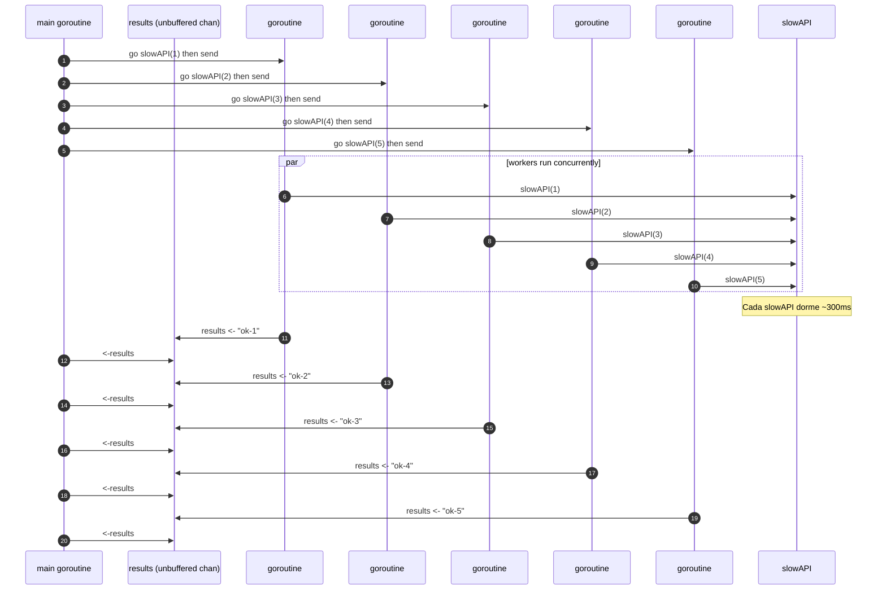

```mermaid
sequenceDiagram
  autonumber
  participant Main as main goroutine
  participant Ch as results (unbuffered chan)
  participant G1 as goroutine #1
  participant G2 as goroutine #2
  participant G3 as goroutine #3
  participant G4 as goroutine #4
  participant G5 as goroutine #5
  participant API as slowAPI

  Main->>G1: go slowAPI(1) then send
  Main->>G2: go slowAPI(2) then send
  Main->>G3: go slowAPI(3) then send
  Main->>G4: go slowAPI(4) then send
  Main->>G5: go slowAPI(5) then send

  par workers run concurrently
    G1->>API: slowAPI(1)
    G2->>API: slowAPI(2)
    G3->>API: slowAPI(3)
    G4->>API: slowAPI(4)
    G5->>API: slowAPI(5)
  end

  Note over API: Cada slowAPI dorme ~300ms

  G1->>Ch: results <- "ok-1"
  Main->>Ch: <-results
  G2->>Ch: results <- "ok-2"
  Main->>Ch: <-results
  G3->>Ch: results <- "ok-3"
  Main->>Ch: <-results
  G4->>Ch: results <- "ok-4"
  Main->>Ch: <-results
  G5->>Ch: results <- "ok-5"
  Main->>Ch: <-results
```
