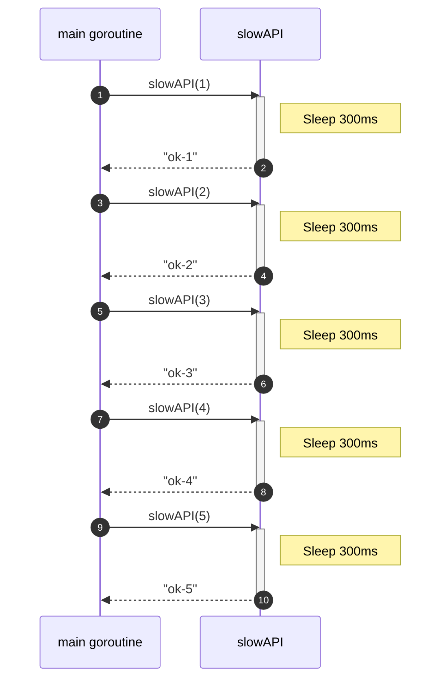

```mermaid
sequenceDiagram
  autonumber
  participant Main as main goroutine
  participant API as slowAPI

  Main->>API: slowAPI(1)
  activate API
  Note right of API: Sleep 300ms
  API-->>Main: "ok-1"
  deactivate API

  Main->>API: slowAPI(2)
  activate API
  Note right of API: Sleep 300ms
  API-->>Main: "ok-2"
  deactivate API

  Main->>API: slowAPI(3)
  activate API
  Note right of API: Sleep 300ms
  API-->>Main: "ok-3"
  deactivate API

  Main->>API: slowAPI(4)
  activate API
  Note right of API: Sleep 300ms
  API-->>Main: "ok-4"
  deactivate API

  Main->>API: slowAPI(5)
  activate API
  Note right of API: Sleep 300ms
  API-->>Main: "ok-5"
  deactivate API
```
