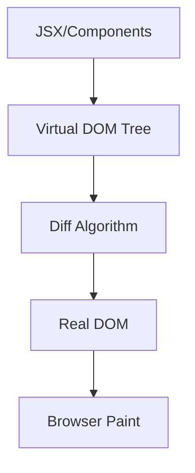

# Virtual DOM

## 📌 What is the Virtual DOM?

The Virtual DOM (VDOM) is an in-memory representation of the real DOM. It is a tree of JavaScript objects that describes how the interface should look. This structure is lighter than the real DOM, allowing React to calculate changes without touching the DOM directly — since the DOM is costly to handle in terms of performance.

## 🔑 Why did it appear?

Manipulating the real DOM is slow because it involves:

- Layout recalculation (page flow recalculation).
- Painting (redrawing pixels → "repaint").
- Cascading reflows (changing one node can affect many others → "reflow").

Before the Virtual DOM, developers manipulated the DOM with jQuery or Vanilla JS, which was really expensive. The Virtual DOM was created to minimize direct access to the DOM and apply only the necessary changes.

## 🧩 How does the Virtual DOM work in React?

Initially, React creates a Virtual DOM tree from JSX components. This tree is synchronized with the real DOM. That's why the application takes longer to load initially — especially in large applications. That's where lazy loading and code splitting come in to improve performance and help user experience.

When state/props change, React generates a new Virtual DOM tree (based on the new state). Then, it compares the old tree with the new one using the reconciliation process based on an algorithm called "Diff" to find out which DOM nodes (elements) changed.

With the Diffing result, React applies a _patch_ containing only the necessary changes to the real DOM.

> Before React Fiber (released in 2017 with React 16), the process was synchronous, meaning the entire tree had to be processed at once. This caused problems in complex apps because long rendering calculations could block the UI thread and freeze the interface.

## 📊 Visual Diagram

Here's a visual diagram to understand how the Virtual DOM works:



## 🔍 Simplified structure of VDOM

Example JSX:

```ts
const App = () => <h1 className="title">Hello</h1>;
```

Virtual DOM (representation in JS):

```json
{
  "type": "h1",
  "props": {
    "className": "title",
    "children": "Hello"
  }
}
```

## 🎯 Practical example: update

```ts
function App({ count }) {
  return <h1>{count}</h1>;
}
```

If count changes from 1 to 2:

- React creates new VDOM tree.
- Diff detects that only the textNode changed.
- Patch applies innerText = "2" to the <h1> real.

## 🖼️ Comparison between Trees

Initial state:

```
Virtual DOM (old) Virtual DOM (new)

<h1>1</h1>                  <h1>2</h1>
```

Diff detects: Text changed: "1" → "2"

The Real DOM `<h1>2</h1>` will be applied.

## ⚡ Advantages of Virtual DOM

- Avoids direct and costly DOM manipulations.
- Updates only what changed (efficient rendering).
- Works declaratively: you describe how the UI should be, not how to change it.
- Base for resources like React Fiber, Concurrent Rendering and Suspense.
