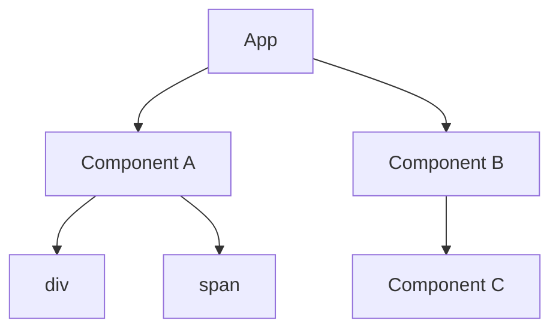

# React Fiber

## 📖 O que é o React Fiber?

O React Fiber é a reimplementação do algoritmo de reconciliação introduzida no React 16 (2017).
Antes dele, o React usava uma abordagem sincrona: toda a árvore precisava ser processada de uma vez só. Isso gerava problemas em apps complexos, pois longos cálculos de renderização podiam travar a UI thread e deixar a interface “congelada”.

O Fiber foi criado para resolver esse gargalo. Ele permite que o React pause, interrompa, reordene e até reutilize trabalhos de renderização, dando prioridade ao que é mais importante (ex.: animações e inputs do usuário).

## 🔑 Diferença principal entre Virtual DOM e Fiber

- Virtual DOM → Representação em memória do DOM real (árvore de nós).
- Fiber → Estrutura de dados + algoritmo que o React usa para percorrer, atualizar e priorizar essa árvore.

Ou seja, o Virtual DOM é o modelo, e o Fiber é o motor que processa esse modelo.

## 🧩 Estrutura do Fiber

Cada fiber node é um objeto JavaScript que representa um elemento da árvore do React.
Ele guarda informações sobre o componente, estado e efeitos pendentes.

```ts
interface FiberNode {
  type: any; // Tipo do elemento (div, MyComponent, etc.)
  key: null | string; // Key usada no diff
  stateNode: any; // Instância do componente ou DOM
  child: FiberNode | null; // Primeiro filho
  sibling: FiberNode | null; // Próximo irmão
  return: FiberNode | null; // Pai
  pendingProps: any; // Props novas
  memoizedProps: any; // Props anteriores
  memoizedState: any; // State anterior
  effectTag: number; // Marca qual efeito aplicar no commit
}
```

## ⚙️ Ciclo do React Fiber

O trabalho do Fiber é dividido em duas fases:

### 1. Render Phase (Work Phase)

- O React cria ou atualiza os _fibers_.
- Pode ser pausada e retomada.
- O objetivo é calcular a árvore de mudanças (work in progress tree).

### 2. Commit Phase

- Aplicar mudanças no DOM real.
- Essa fase é sincrona e não pode ser interrompida (senão o DOM ficaria inconsistente).

## 🎯 Priorização e Concorrência

O Fiber introduz o conceito de "prioridade" para atualizações:

- User interactions (alta prioridade) → cliques, inputs, animações.
- Background updates (baixa prioridade) → carregamento de dados, logs, etc.

Isso é o que permitiu o Concurrent Mode e, futuramente, o React 18 Automatic Batching.

## 📊 Diagrama visual do Fiber



```mermaid
subgraph Virtual DOM (descrição estática)
end

subgraph Fiber (motor dinâmico)
Bf[FiberNode A]
Cf[FiberNode B]
Df[FiberNode div]
Ef[FiberNode span]
Ff[FiberNode C]
end
```

## 🖼️ Representação da Árvore Fiber

Cada nó fiber conecta pai, filho e irmão → linked list em árvore:

```text
return (pai)
↓
[Fiber A] → sibling → [Fiber B] → sibling → null
↓ child
[Fiber div] → sibling → [Fiber span]
```

## 💡 Exemplo prático

```ts
function App() {
  return (
    <div>
      <h1>Hello</h1>
      <p>World</p>
    </div>
  );
}
```

Virtual DOM (abstração):

```json
{
  "type": "div",
  "children": [
    { "type": "h1", "props": { "children": "Hello" } },
    { "type": "p", "props": { "children": "World" } }
  ]
}
```

Fiber Tree (estrutura real usada pelo React):

```text
Fiber(App)
└── Fiber(div)
├── Fiber(h1)
└── Fiber(p)
```

Cada Fiber node tem ponteiros (child, sibling, return) que permitem traversal eficiente e pausável.

## 🚀 Benefícios trazidos pelo Fiber

1. Interrupção de renderização → não travar a UI.
2. Atualizações priorizadas → melhor UX.
3. Reuso de trabalhos → eficiência.
4. Fundamento para Concurrent React → usado no React 18+.
5. Suporte a Suspense e Streaming SSR.

## 📚 Referências recomendadas

- [React Fiber Architecture – Andrew Clark](https://github.com/acdlite/react-fiber-architecture)
- [React Docs – Reconciliation](https://react.dev/learn/reconciliation)
